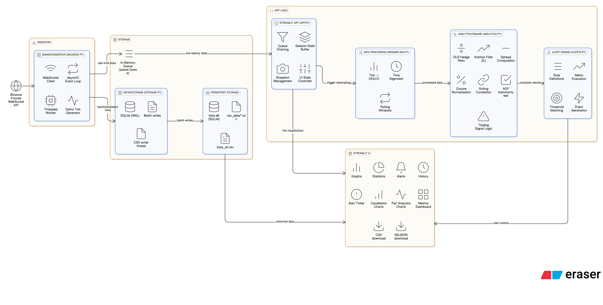

# Real-Time Quantitative Analytics Dashboard

A real-time crypto market analytics dashboard built with Streamlit, providing live tick ingestion from Binance Futures, OHLCV charting, pair trading analytics, statistical signals, and a flexible alerting engine.
This project is designed to demonstrate quantitative trading concepts, real-time data pipelines, and interactive analytics in a production-style architecture.

This project is developed as part of the **Gemscap Assignment** .
(will convert into modular)

## 1. Overview

This project is a real-time quantitative trading dashboard designed to demonstrate how live market data can be ingested, analyzed, and visualized for pairs trading and market-neutral strategies.
Demonstation Link: https://drive.google.com/file/d/1M3VggcO2sdSJDohpauFGOxq7MhZoEsFQ/view?usp=sharing

### The System demonstration:

-   **Live tick ingestion** using Binance WebSocket(with optional demo mode)
-   **Sampling** into OHLCV (1s, 1m, 5m)
-   **Advanced analytics**:
    *   Hedge Ratio estimation (OLS regression)
    *   Dynamic Hedge Ratio (Kalman Filter)
    *   Spread & Z-Score calculation
    *   Rolling Correlation analysis
    *   ADF Stationarity test 
-   **Buy / Sell signal generation** based on statistical deviation
-   **Interactive real-time dashboard** Streamlit
-   **Alert engine** for threshold-based triggers(Z-score, spread, correlation, ADF)
-   **Data export** for ticks & analytics with csv
-   **Scalable backend architecture**

## 2. Architecture
```
Binance WebSocket
        ↓
Ingestion Engine (Async / Threaded)
        ↓
In-Memory Buffer + Persistent Storage
(SQLite / CSV / NDJSON)
        ↓
Resampling Engine
(Tick → OHLCV)
        ↓
Analytics Engine
(OLS, β, Spread, Z-Score, Correlation, ADF)
        ↓
Alert Engine
(Rule-Based Triggers)
        ↓
Streamlit Frontend
        ↓
Real-Time Charts • Statistics • Signals • Exports
```

(drawn with the help of eraser.io)


## 3. Project Structure

```
Project/
│── app.py                 
│── backend.py             
│── analytics.py           
│── alerts.py              
│── storage.py             
│── resampling.py          
│── data/                  
│── docs/                 
│── req.txt
│── README.md
```

## 4. Installation

1.  **Clone the repository**
    ```bash
    git clone <repository-url>
    cd <project-directory>
    ```

2.  **Create Virtual Environment**
    ```bash
    python -m venv venv

    # Windows
    venv\Scripts\activate

    # Linux/Mac
    source venv/bin/activate
    ```

3.  **Install Dependencies**
    ```bash
    pip install -r req.txt
    ``` 

## 5. Running the Application

1.  **Start the Dashboard**
    ```bash
    streamlit run app.py
    ```

2.  **Using the UI**
    -   Enter symbols (e.g., `BTCUSDT,ETHUSDT`)
    -   Select timeframe (1s, 1m, 5m)
    -   View Price, Spread, Z-Score, Correlation, ADF
    -   Configure alerts (e.g., `Z > 2`, `Spread < -10`)
    -   Download CSV data

## 6. Analytics Implemented

### 1. Hedge Ratio (OLS Regression)
The hedge ratio defines the linear relationship between two assets and is estimated using Ordinary Least Squares (OLS) regression:

$$
Y = \beta X + \epsilon
Y = price of asset 1
x = price of asset 2
beta = hedge ratio
espilon = error

$$

### 2. Spread
The spread measures the relative mispricing between two assets after applying the hedge ratio:
$$
Spread = Y - \beta X
$$

### 3. Z-Score
The Z-score normalizes the spread to quantify its deviation from historical behavior:
$$
Z = \frac{Spread - \mu}{\sigma}

where:
mu = Rolling mean of the spread
sigma = Rolling standard deviation

example usage:
Large positive Z-score → Overextended spread
Large negative Z-score → Underextended spread
$$

### 4. Rolling Correlation
Rolling correlation measures the consistency of co-movement between two assets:
    Computed using Pearson correlation
    Evaluated over a sliding time window

### 5. ADF(Augmented Dickey–Fuller) Test
**Null Hypothesis:** Spread has unit root (not stationary).
**Interpretation:** p-value < 0.05 → Mean-reverting.

p-value < 0.05 → Spread is stationary (mean-reverting)
p-value ≥ 0.05 → Spread is non-stationary

## 7.Buy / Sell Signal Logic

Trading signals are generated based on Z-score thresholds:
BUY_SPREAD → Spread is unusually low (expect upward reversion)
SELL_SPREAD → Spread is unusually high (expect downward reversion)
EXIT → Spread has reverted to its mean
This logic enables systematic, rule-based decision making.

## 8. Alerts Engine

Rules can be defined such as:
-   `Z-Score > 2`
-   `Spread < -5`
-   `Price > 90000`

Alerts appear in:
-   Real-time dashboard
-   Alert history log

enabling real-time monitoring and automated notifications.

## 9. Data Export

Exportable from the dashboard:
-   Tick-level data (CSV)
-   OHLCV data (CSV)
-   Analytics CSVs

## 10. Summery:
Together, these analytics provide:
    Market-neutral pair construction
    Statistical validation of relationships
    Adaptive modeling via Kalman filtering
    Rule-based signal generation
    Real-time decision support

## 11. Methodology

The system is designed and implemented following standard real-time data processing and quantitative analysis principles, aligned with the assignment requirements and industry best practices.

-   Modular, scalable backend
-   WebSocket ingestion decoupled from analytics
-   Asynchronous I/O for real-time performance
-   Clear separation: ingest → store → resample → analyze → visualize
-   Extensible pipeline for additional analytics

Processing Flow:
    - Ingest → Buffer → Resample → Analyze → Signal → Visualize

    Ingest: Live tick data is streamed via WebSocket and processed in the background

    Buffer: Ticks are stored in memory for fast access and short-term persistence

    Resample: Tick data is aggregated into OHLCV candles across multiple timeframes

    Analyze: Statistical and quantitative analytics are applied to price series

    Signal: Buy/Sell decisions are derived using rule-based logic

    Visualize: Results are presented through a real-time interactive dashboard

## 12. LLM Usage Transparency

Including ai into normal projects helps to speed up and develop projects quickly

oLLAMA is used for 
-  Getting general information regarding quant and respective terminologies
-  boiler plate code for websocket (than reading docs)
-  debugging certain functionalites
-  ReadMe Structure
-  to kick start basic Workflow 
-  to refactor and remove unnecessory/redundant code making it readble

Prompts focused on:
-   Improving conceptual knowledge
-   Ensuring alignment with assignment requirements
-   Visualizing system architecture and data flow
-   Refining explanations for documentation and presentation


## N. Future Scope & Enhancements
The current system focuses on real-time market analytics and decision support.

Several enhancements can be implemented to evolve it into a full-fledged trading platform:
*   portfolio tracking
*   Risk Tracking
*   Machine learning INtroduction
*   Further deployment
*   Papar trading option to test current system
*   Additional information regarding quant to add (like bias , patterns And things that i dont know right now)
